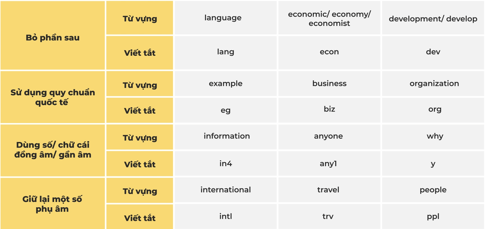
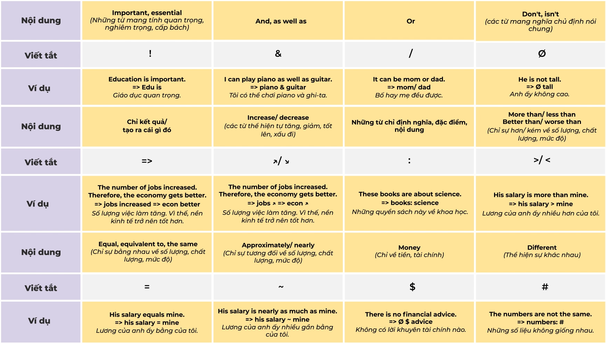
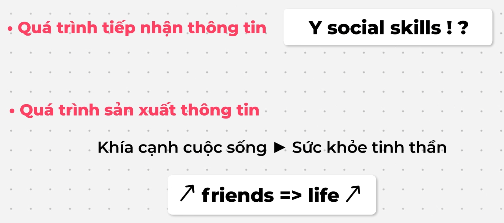
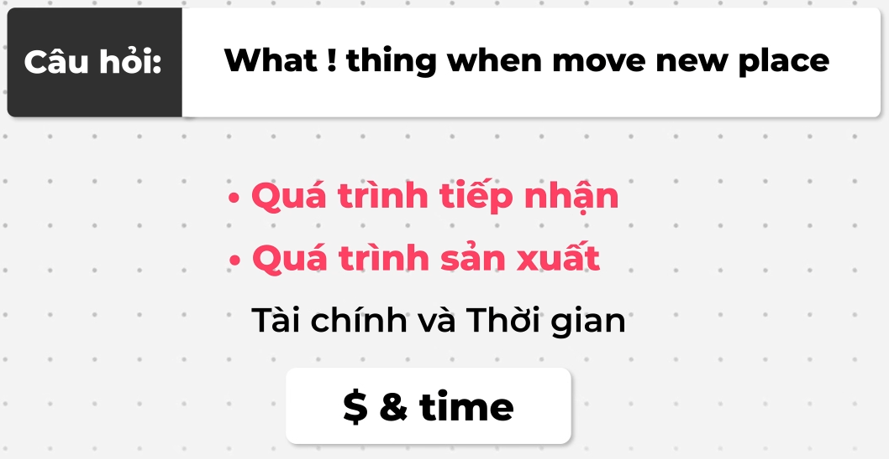

# Table of Contents

[I. Speaking](#speaking)
- [Lesson 1](#s_lesson1)
    - [Dạng đề bài](#s_lesson1_1)
    - [Phương pháp mở rộng câu](#s_lesson1_2)
    - [Phương pháp ghi chú](#s_lesson1_3)
- [Lesson 2](#s_lesson2)
- [Lesson 3](#s_lesson3)
- [Lesson 4](#s_lesson4)
- [Practice](#s_practice)
    - [Ex 1: What kinds of books do you usually read?](#s_ex1)
    - [Ex 2: Is time management an important skill?](#s_ex2)

[II. Writing](#writing)

[III. Các cấu trúc câu](#structure)

[IV. ChatGPT Prompt](#gpt)

---

<a id = "speaking"></a>
# I. Speaking

## Lesson 1: Phương pháp phân tích đề bài

### Dạng đề bài: 2 loại
    - **Dạng đề bài 1 yêu cầu**
        - Loại 1: Câu hỏi
        
        Có một từ để hỏi hoặc một trợ động từ đảo lên trước chủ ngữ.

        - Loại 2: Câu mệnh lệnh

        Bắt đầu bằng một ĐT nguyên thể, thường bắt đầu bằng từ **Please** tăng tính lịch sự
    
    - **Dạng đề bài nhiều yêu cầu**: từ 2 yêu cầu trở lên

### Phương pháp mở rộng câu trả lời: **AREF**
- **A: Answer**
    - Sử dụng chính đề bài
    - Dùng cấu trúc và từ vựng khác
- **R: Reason**
    - Cung cấp lí do giải thích cho câu **Answer**
- **E: Elaboration/ Example**
    - Elaboration: các câu diễn giải thêm cho **Reason**
    - Example: minh họa hoặc chứng minh cho lí, lấy ví dụ về bản thân
- **F: Feeling**
    - Thể hiện cảm nhận hay suy nghĩ
```
    I think [vấn đề] is [tính từ]
    I [động từ chỉ cảm xúc] + vấn đề
```
- Mẹo nghĩ ý tưởng cho yếu tố **Reason**: Các khía cạnh cuộc sống
```
    - Tài chính
    - Sức khỏe
        - Thể chất
        - Tinh thần
    - Thời gian
    - Cá nhân
        - Học tập
        - Sự nghiệp
        - Kỹ năng
        - Tư duy
        - Sở thích
        - Nhu cầu
```

### Phương pháp ghi chú

- Kỹ năng ghi chú là kỹ năng tóm gọn các thông tin quan trọng bằng cách
    - Không viết lại cả câu
    - Ghi chú các từ khóa
    - Sử dụng viết tắt và ký hiệu

=> Rút ngắn thời gian ghi chép

=> Được sử dụng trong 2 quá trình:
- **Quá trình tiếp nhận thông tin**:
    - Nghe
    - Đọc
- **Quá trình sản xuất thông tin**:
    - Nói
    - Viết

- 3 phương pháp ghi chú:
    - **Rút gọn câu**
    - **Viết tắt từ**
    - **Ký hiệu hóa từ**

#### A. Phương pháp rút gọn câu

- **Function words** (từ chức năng): 
    - Từ quan trọng về mặt ngữ pháp, không mang nghĩa trong câu
    - Giới từ, đại từ, mạo từ, trợ động từ...
- **Content words** (từ nội dung):
    - Từ quan trọng về mặt ngữ nghĩa
    - Thường là danh từ, động từ & tính từ

=> Khi ghi chú chỉ cần ghi content words, dùng từ nguyên thể

```
Example: Can you estimate the amount of money you usually spend on your phone?
- Quá trình tiếp nhận thông tin: amount money phone
- Quá trình sản xuất thông tin: liên quan đến giá tiền => chỉ cần ghi giá tiền => Approximately $400

Example: When does the store open?
- Quá trình tiếp nhận thông tin: when store open
- Quá trình sản xuất thông tin: liên quan đến thời gian => 8 PM
```

#### B. Phương pháp viết tắt từ
- Chỉ viết một số chữ cái của từ

```
Example: What subjects are you into?
- Quá trình tiếp nhận thông tin: what subject into | subject into
- Quá trình sản xuất thông tin: 
    - Languages => Lang
    - Economics => Econ
=> Chỉ viết một số chữ cái đầu
```

- Một số từ viết tắt:


#### C. Phương pháp ký hiệu hóa từ
- Thể hiện các từ qua các ký hiệu

- Một ký hiệu:


- Example 1: Why are social skills important?


- Example 2: What are the important things you would consider when moving to a new place?


<a id = "s_practice"></a>
## Practice

<a id = "s_ex1"></a>
### Ex 1: What kinds of books do you usually read?

```
Answer: Adventure books
Reason: Relax after a long day
Elaboration: In another world, 
             forget all my problems
Example: Tire and stressed,
         favorite adventure book
         feel better
Feeling: Like

I usually read adventure books. They help me relax after a long day.
When I read adventure books, I feel like I'm living in another world and forget all my problems.
Last night, I was tired and stressed, but after reading my favorite adventure book, I felt much better.
I like adventure books.
```

```
Answer: Adventure books
Reason:
- Tư duy cá nhân: More creative
- Sở thích cá nhân: Like exploring things
Elaboration: 
- More creative: Experience more things
- Like exploring things: Information about many different things
Example:
- More creative: In the past, not creative
                 Now, think of many new ideas
- Like exploring things: books about places, animals and people
Feeling: Love

The kinds of books I usually read are adventure books. They make me more creative.
They help me experience more things. In the past, I was not creative. Now, I can think of many new ideas.
I love adventure books.

The kinds of books I usually read are adventure books. I like exploring things.
Books give me information about many different things. I have books about different places, animals and people.
I love adventure books.

```

<a id = "s_ex2"></a>
### Ex 2: Is time management an important skill?

```
Answer: 
Reason:
- Tài chính: Allocati more time => Time management helps a person allocate more time for profitable tasks.
- Thời gian: Save time => It can help save time.
- Sức khỏe: Reduce stress, Improve mental health =>  It can reduce stress and improve mental health
- Cá nhân: My interests => It gives me time to focus on my interests.
Elaboration:
Example:
Feeling:
```

```
- Sử dụng lại đề bài để tạo yếu tố Answer.
- Sử dụng nhóm chủ đề "Các khía cạnh đời sống" để nghĩ yếu tố Reason.
- Dựa vào Reason và Answer để nghĩ yếu tố Elaboration hoặc Example.
- Lấy ví dụ từ bản thân để nghĩ yếu tố Example
- Sử dụng một trong hai cấu trúc đã học để tạo yếu tố Feeling.
```

<a id = "s_ex3"></a>
### Ex 3: Do you have a plan to move out in the near future?

```
Answer: No
Reason: Close my company, save money
Elaboration: Save time
Example: Only 5 minutes commute my house and company
Feeling: 
```

```
Answer: No, I don't have plans to move out in the near future
Reason: 
- Tài chính: My current place is cheap.

Elaboration: 
- Tài chính: It helps me save money.

Example:
- Tài chính: It only costs me $200 a month.
Feeling: I think it is economical

No, I don't have plans to move out in the near future. My current place is cheap.
It helps me save money. It only costs me $200 a month. I think it is economical.
```

<a id = "speaking"></a>
# II. Writing

```
Answer:
Reason:
Elaboration:
Example:
Feeling:
```

<a id = "structure"></a>
# III. Các cấu trúc câu

- Thể hiện cảm nhận hay suy nghĩ
```
    I think [vấn đề] is [tính từ]
    I [động từ chỉ cảm xúc] + vấn đề
```

<a id = "gpt"></a>
# IV. ChatGPT Prompt

```
Question: What kind of housing do you live in?
Answer: Apartment
Reason: Close to my office
Elaboration: Save time, convenient
Example: Just 10 minutes walk to work
Feeling: Comfortable and satisfied
✅ Tôi muốn bạn:
Sửa lỗi
Viết lại 3 bản khác nhau
Dịch nghĩa các từ quan trọng
Liệt kê cấu trúc câu
Dịch toàn đoạn sang tiếng Việt
🎯 Mục tiêu: Speaking-style
```

```
🪶 📍Daily Writing Practice Template
🧩 Question:
✍️ My draft:
Answer: …
Reason: …
Elaboration: …
Example: …
Feeling: …
🎯 Focus today:
(Chọn hoặc ghi nhanh) → Grammar / Vocabulary / Paraphrase / IELTS tone / Natural flow
💬 Style:
(Speaking / Writing / Mixed)
💡 Extra note (optional):
👉 ……………………………………………………………
```